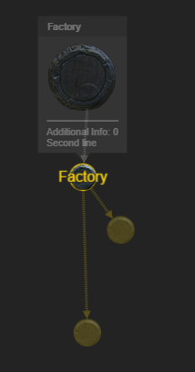
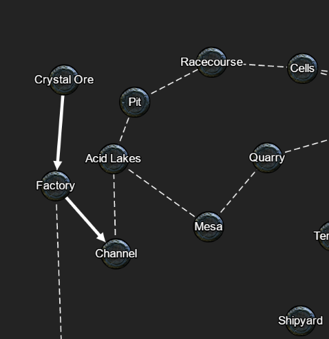
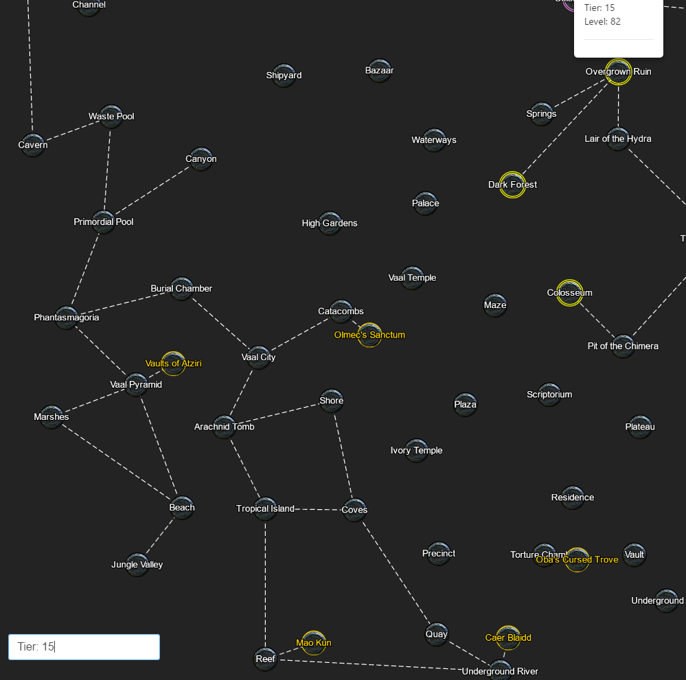

# Atlas visualization in JS

Test it here: https://fwidm.github.io/cytoscape-poe-map-visualization/

----------------------------------------------------------------------

In an attempt to rewrite the atlas visualization from the forked ShareAtlas repo we will utilize cytoscope to build the entire atlas. Instead of using one pre-defined image as the original author did before.
Current Progress:
- added basic functionality to add/remove nodes
- loads sample data from a pre-defined function
- parsed map data to json
- highlights currently selected map
- shows information about the current object when hovering.
- shows upgrade paths
- differentiates between unique maps
- save and load maps via url param
- comparison between two atlas stats (?maps=20000000000000000000000000000001&compareTo=20000000000000000000000000000000)
- Search
    - Map tier `tier: x`
    - Unique maps: `unique`
    - Shaper orbs: `shaper orb` or by shaper orb tier: `shaper orb tier: x`
    - Tooltip
    - highlight the last selected maps
    - unselect searched maps

Todo:
- Compare more than 1 tree
- Add a comparison button that takes one url for each tree we want to compare to our tree
- After clicking into the search bar, the qtip explanation doesn't disapper when clicking inside the nodes

---
# Expected Map Json:
Required: id, name, tier, posX, posY - dotted lines are connected to all "parents". Normal arrow line is connected to the map it upgrades to.

```json
    {
      "mapId": 4,
      "name": "Factory",
      "tier": 2,
      "posX": 0.17781414091587067,
      "posY": 0.24188481271266937,
      "unique": false,
      "parents": [
        {
          "mapId": 0
        }
      ],
      "upgradesTo":{
        "mapId":8
      }
    }
```
---
| Feature | Image |
| ------- | ----- |
| Qtip on Click |  |
| Dotted lines for possible map drops, arrow lines to show upgrade paths |  |
| Search for either Map names (that start with the string) or filter by tiers by searching with `tier: x` |  |